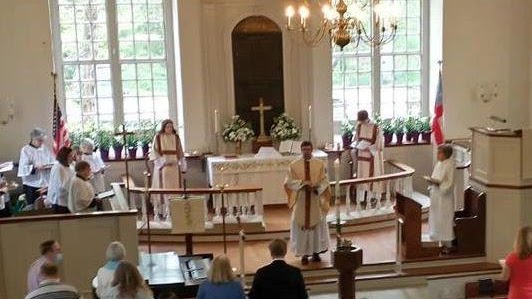

<header class="wrapper bg-light">
  
</header>

<section class="wrapper bg-light">

<article class="card shadow-lg">

Ware Episcopal Church

Address: 7825 John Clayton Memorial Hwy, Gloucester, VA 23061

Phone: (804) 693-3821

Opened: 1690

NRHP Reference Number: 73002018

Hugh Gwynn

**Gwin/Gwinne/Gwyn, Hugh** - A3303; Charles River: 1640, York Co.: 1646,
Gloucester Co.: 1652 (Burgess). 
