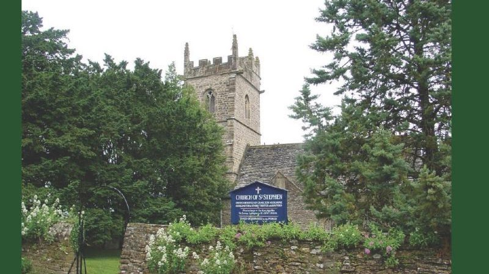

{width="7.5in"
height="4.209722222222222in"}

[Haskell Family Association](http://hfa.haskells.net/genealogy.html)

William Haskell was Churchwarden at the Church of St. Stephen in
Charlton Musgrove, England in 1627 -- 1628. He married Elinor Foule in
1610. They had seven children who were baptised in Charlton Musgrove,
Somerset, England. The three sons, Roger (bp. 6 Mar 1613/14), William
(bp. 8 Nov 1618), and Mark (bp. 8 Apr 1621) emigrated to Massachusetts
in the New World. Most Haskells in the U.S. are descended from one of
these three brothers.
