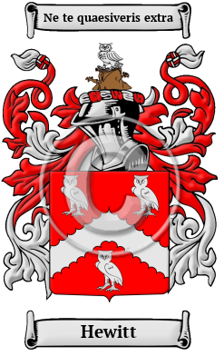

<section class="wrapper bg-light">

<article class="card shadow-lg">

{width="2.5729166666666665in"
height="4.083333333333333in"}

[Hewitt](https://houseofnames.com/Hewitt-family-crest)

Hewitt is a name that was brought to England by the ancestors of the
Hewitt family when they migrated to the region after the Norman Conquest
in 1066. The Hewitt family lived in Huet or Huest near Evreux in
Normandy, France. Many variations of the name Hewitt have been found,
including Hewitt, Hewett, Hewatt, Hewet, Hewit, Hewat and others. 

In the United States, the name Hewitt is the 973rd most popular surname
with an estimated 29,844 people with that name
