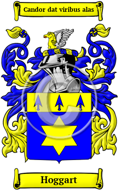

{width="2.5729166666666665in"
height="4.083333333333333in"}

[Hoggart](https://houseofnames.com/Hoggart-family-crest)

The name Hoggart is rooted in the ancient Anglo-Saxon culture. It was
originally a name for someone who worked as a keeper of cattle and pigs.
The surname Hoggart originally derived from the Old English words
\"hogg\" + \"hierde.\" The variations of the name Hoggart include
Hogarth, Hoggart, Hoggarth, Hoggard, Hoggarde and others.  
