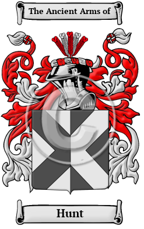

{width="2.5729166666666665in"
height="4.083333333333333in"}

[Hunt](https://houseofnames.com/Hunt-family-crest)

The name Hunt finds its origins with the ancient Anglo-Saxons of
England. It was given to one who worked as a hunter. The surname Hunt is
derived from the Old English word hunta, which means hunter. Hunt has
been recorded under many different variations, including Hunt, Hunter,
Huntar and others.

In the United States, the name Hunt is the 148th most popular surname
with an estimated 156,681 people with that name
