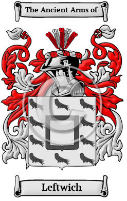
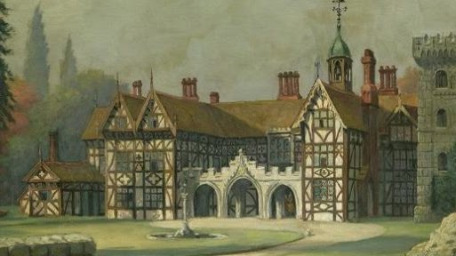
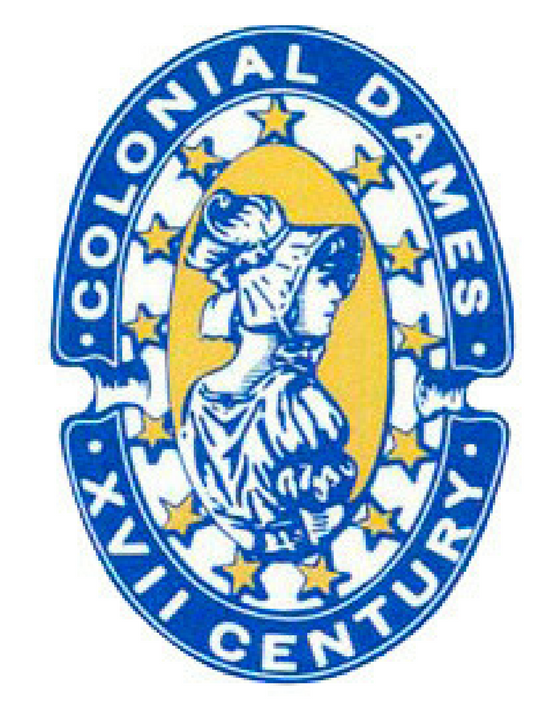
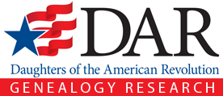

<section class="wrapper bg-light">

<article class="card shadow-lg">

[Family Crest & Coats of Arms](https://www.houseofnames.com/leftwich-family-crest)

The surname Leftwich was first found in Cheshire where they held a
family seat as Lords of the Manor. After the Battle of Hastings in 1066,
William, Duke of Normandy, having prevailed over King Harold, granted
most of Britain to his many victorious Barons. It was not uncommon to
find a Baron, or a Bishop, with 60 or more Lordships scattered
throughout the country. These he gave to his sons, nephews and other
junior lines of his family and they became known as under-tenants. They
adopted the Norman system of surnames which identified the under-tenant
with his holdings so as to distinguish him from the senior stem of the
family. After many rebellious wars between his Barons, Duke William,
commissioned a census of all England to determine in 1086, settling once
and for all, who held which land. He called the census the Domesday
Book, \[1\] indicating that those holders registered would hold the land
until the end of time. Hence, conjecturally, the surname is descended
from the tenant of the lands of Lestwich, held by Richard de Vernon, a
Norman Baron, who was recorded in the Domesday Book census of 1086.
Lestwich was a large village on the banks of the River Dane notable for
its Lea Grange Farm.

In the United States, the name Leftwich is the 6,637th most popular
surname with an estimated 4,974 people with that name.

[Leftwich Historical Association](https://www.leftwich.org/?page_id=56)

Leftwich Historical Association (LHA) was organized on October 10, 1992,
in Lynchburg, Virginia, with 16 charter members. The Association was
established as a non-profit organization devoted to assembling and
preserving genealogical and historical information pertaining to the
Leftwich family. LHA was incorporated in the Commonwealth of Virginia on
November 3, 2000.  LHA annually publishes The Leftwich Heritage, a
newsletter dealing with new genealogical finds and family interests. An
annual family reunion for all members is also sponsored by the Leftwich
Historical Association.

[Ralph Leftwich](https://www.colonialdames17c.org/i4a/pages/index.cfm?pageid=3301)

Ancestor Lineages of Members Texas Society/National Society Colonial
Dames Seventeenth Century

[Thomas Leftwich](http://www.virginiafoundingfathers.org/ancestors.html)

Leftwich, Sr. Thomas VA, 1660s

[Augustine Leftwich S](https://services.dar.org/Public/DAR_Research/search_adb/?action=full&p_id=A068950)r.

Service:  VIRGINIA    Rank(s): PATRIOTIC SERVICE

Birth:  CIRCA 1712 NEW KENT CO VIRGINIA

Death:  ANTE 6-22-1795  BEDFORD CO VIRGINIA

Service Source:  ABERCROMBIE & SLATTEN, VA REV PUB CLAIMS, VOL 1, P 114

Service Description:  **1) **BEDFORD CO, RENDERED MATERIAL AID
