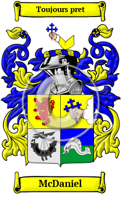

{width="2.5729166666666665in"
height="4.083333333333333in"}

[McDaniel](https://houseofnames.com/McDaniel-family-crest)

The west coast of Scotland and the rocky Hebrides islands are the
ancient home of the McDaniel family.  McDaniel has appeared in various
documents spelled MacDaniel, MacDaniell, MacDanell and others.

In the United States, the name McDaniel is the 302nd most popular
surname with an estimated 89,532 people with that name
