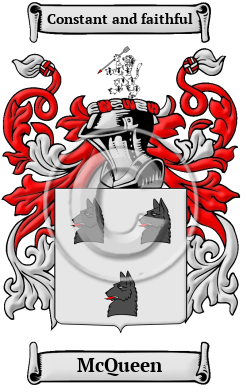

{width="2.5729166666666665in"
height="4.083333333333333in"}

[McQueen](https://houseofnames.com/McQueen-family-crest)

The west coast of Scotland and the rocky Hebrides islands are the
ancient home of the McQueen family. The root of their name is Suibhne,
an old Gaelic forename which probably means good-going or well-going.
The Gaelic form of the surname is Mac Shuibhne. McQueen has been spelled
MacQueen, MacQueon, MacSween, MacSwene, MacSweyne, MacSwan, MacCunn and
many more.

In the United States, the name McQueen is the 1,322nd most popular
surname with an estimated 22,383 people with that name
