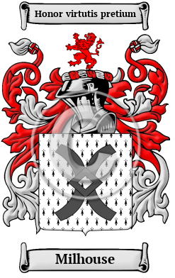

{width="2.5729166666666665in"
height="4.083333333333333in"}

[Milhouse](https://houseofnames.com/Milhouse-family-crest)

Milhouse is an ancient Norman name that arrived in England after the
Norman Conquest of 1066. The Milhouse family lived at or near a mill
having derived from the Old English word mylen, which meant mill.  The
name has been spelled Mills, Mylles, Meiles and others.
