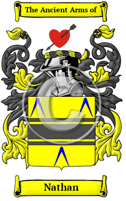

{width="2.5729166666666665in"
height="4.083333333333333in"}

[Nathan](https://houseofnames.com/Nathan-family-crest)

The surname Nathan was first found in Nottinghamshire where they held a
family seat as Lords of the Manor.  Nathan has been recorded under many
different variations, including Nathan, Natan, Nation, Nations, Nusan,
Nusen and others.

In the United States, the name Nathan is the 4,569th most popular
surname with an estimated 7,461 people with that name.
