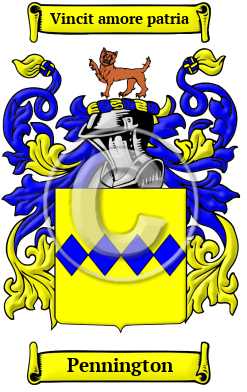

{width="2.5729166666666665in"
height="4.083333333333333in"}

[Pennington](https://houseofnames.com/Pennington-family-crest)

The Anglo-Saxon name Pennington comes from the family having resided in
Lancashire at Pennington. Interestingly, two sources claim the name
literally means \"farmstead paying a penny rent.\"  Spelling variants
included: Pennington, Penington and others.

In the United States, the name Pennington is the 732nd most popular
surname with an estimated 39,792 people with that name. 
