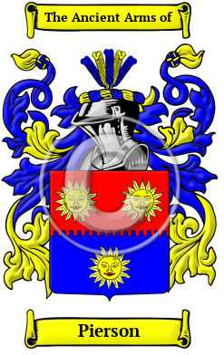

<section class="wrapper bg-light">

<article class="card shadow-lg">

{width="2.5729166666666665in"
height="4.083333333333333in"}

[Pierson](https://houseofnames.com/Pierson-family-crest)

The name Pierson reached English shores for the first time with the
ancestors of the Pierson family as they migrated following the Norman
Conquest of 1066. The name Pierson is based on the French given name
Pierre, which is equivalent to the English Peter as in son of Peter or
Pierre. The variations of the name Pierson include Pearson, Peerson,
Pierson, Peirson and others.

In the United States, the name Pierson is the 1,163rd most popular
surname with an estimated 27,357 people with that name
