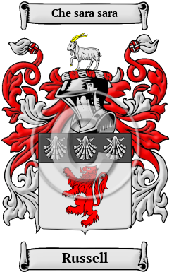

{width="2.5729166666666665in"
height="4.083333333333333in"}

[Russell](https://houseofnames.com/Russell-family-crest)

The name Russell was carried to England in the enormous movement of
people that followed the Norman Conquest of 1066.  The name has been
spelled Russell, Russel and others.

In the United States, the name Russell is the 97th most popular surname
with an estimated 211,395 people with that name.
