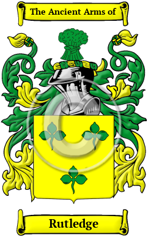

{width="2.5729166666666665in"
height="4.083333333333333in"}

[Rutledge](https://houseofnames.com/Rutledge-family-crest)

The surname Rutledge was first found in Cumberland.  Spelling variations
include: Rutledge, Routlege, Routlidge, Routledge, Rutlidge and many
more.

In the United States, the name Rutledge is the 920th most popular
surname with an estimated 32,331 people with that name
