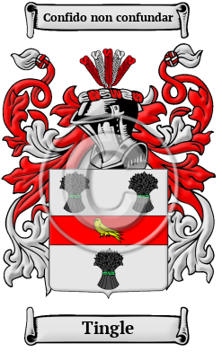

{width="2.5729166666666665in"
height="4.083333333333333in"}

[Tingle](https://www.houseofnames.com/tingle-family-crest)

The name Tingle, like many surnames, is occupational in origin,
referring to the job that the first bearer did for a living. In this
case, it is metonymic, coming not from the name of the occupation
itself, but rather from the product made. A tingle is a very small nail,
often used in the making of shoes. The first Tingle was most likely
someone who made such nails. The surname Tingle was first found in
Cambridgeshire, where the name first appeared in the early 13th century.
In the United States, the name Tingle is the 6,833rd most popular
surname with an estimated 4,974 people with that name
