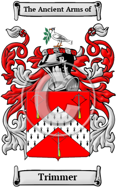

<section class="wrapper bg-light">

<article class="card shadow-lg">

{width="2.5729166666666665in"
height="4.083333333333333in"}

[Trimmer](https://houseofnames.com/Trimmer-family-crest)

The surname Trimmer was first found in Cornwall in the parish of Lanivet
where \"the manor of Tremere belonged at a very early period to a family
of that name; but on the extinction of the male branches, it was carried
by an heiress to the St. Aubyns, from whom it passed into the Robartes
family. In Lanivet churchyard there are two very ancient crosses, both
of which appear to have been much ornamented, though they are now
greatly corroded by time, and the constant action of the elements. One,
which stands on the north side of the church, is about ten feet high ;
this was decorated on both sides chiefly with braids. The other, which
is near eleven feet high, and stands near the west end of the church,
seems to have been ornamented with scrolls. This stone is perforated
with four holes near its summit; but to what use they were applied, it
is scarcely possible to conjecture. Within the church are some monuments
of the Courtenay family of Tremere.\"  This family name include:
Trimmer, Trimmor, Trymmer, Trimmar, Trymmar, Trimer, Tremer, Tremere,
Tremmer and many more.

In the United States, the name Trimmer is 
