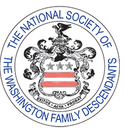

<section class="wrapper bg-light">

<article class="card shadow-lg">

[Washington Family Driving
Tour](https://maps.app.goo.gl/y1EL1t6r1vGrfgR66)

https://maps.app.goo.gl/y1EL1t6r1vGrfgR66

{width="2.1770833333333335in"
height="2.2604166666666665in"}

[National Society of the Washington Family
Descendants](https://www.washingtonfamilydescendants.org/join-us)

We are a group of over 500 members who can all trace their ancestry to a
few of the founding families. We provide leadership in the collection
and recording of data, documents and materials relating to the Colonial
and Federal periods of the Washington Family. NSWFD also contributes
financial assistance to selected organizations with related aims and
purposes. 
