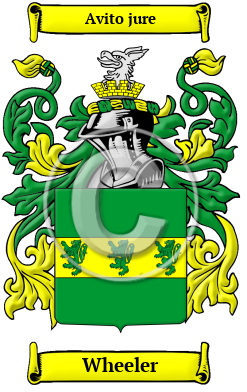

<section class="wrapper bg-light">

<article class="card shadow-lg">

{width="2.5729166666666665in"
height="4.083333333333333in"}

[Wheeler](https://houseofnames.com/Wheeler-family-crest)

The many generations and branches of the Wheeler family can all place
the origins of their surname with the ancient Anglo-Saxon culture. Their
name reveals that an early member worked as a wheelwright. In medieval
times wheels were wooden and quite fragile and high maintenance. Thus
there was a high demand for both wheels and skilled people to make and
repair them.  Over the years, many variations of the name Wheeler were
recorded, including Wheeler, Wheler, Wheller and others.

In the United States, the name Wheeler is the 208th most popular surname
with an estimated 126,837 people with that name
