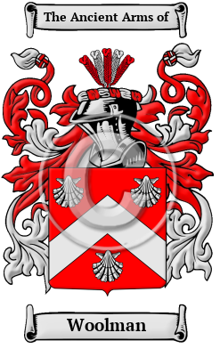

{width="2.5729166666666665in"
height="4.083333333333333in"}

[Woolman](https://houseofnames.com/Woolman-family-crest)

The surname Woolman was first found in Hampshire at Woolmer, between
Liphook and Bordon. The surrounding Woolmer (Wolmer) Forest, is a Royal
forest. Woolmer Green is a small village and civil parish in
Hertfordshire. Variations of the  family name include: Wolmer, Woolmer,
Wollmore, Woolman, Ullmer, Ulmer, Wollmer, Wulmar, Wulmare, Wilmore,
Wilmer, Wilmere, Wulmere, Woolmore, Woolmore, Wollmor and many more.
